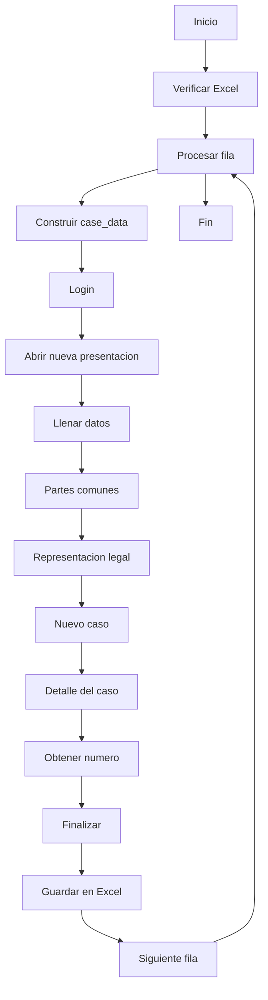

# crea_demanda_bot

Automatiza el inicio de una nueva presentación/demanda desde cero en el sistema (Selenium), tomando datos desde un Excel y registrando el número de presentación obtenido.

## Objetivo
- Leer filas de una planilla de casos.
- Cargar datos del caso (personería, municipalidad, detalle, decreto) en el sistema.
- Obtener y guardar el número de presentación por cada fila.

## Entradas (por defecto en `main.py`)
- Excel: `tables/Sonzini - Iniciar demanda - 2024 (escaneados).xlsx`
- Configuración: `config.py → users["SONZINI"]` con:
  - `matricula`, `password`
  - `procurador`
  - `numero_decreto`, `fecha_decreto`
  - `municipalidad_keyname_to_search`, `municipalidad_keyname_to_represent`

## Columnas esperadas en Excel
- `Archivo`
- `Nombre o Razón Social`
- `CUIT`
- `Repartición`
- `Orden`
- `Año`
- `Identificador`
- `Domicilio`
- `Monto total`
- `Tipo de Persona`
- `Presentación` (se completa por el bot; si ya existe, se salta la fila)

## Flujo (alto nivel)
1. Verifica existencia y contenido del Excel.
2. Itera filas; si `Presentación` ya tiene valor, salta.
3. Construye `case_data` normalizando valores (por ejemplo, quita decimales a `CUIT`, `Orden`, `Año`, `Identificador`).
4. Ejecuta steps Selenium:
   - `user_login` → `open_new_tab` → `click_new_presentation` → `fill_presentation_data_step` → `step_2_common_parts` (usa `municipalidad_keyname_to_search`) → `step_legal_representation` (usa `procurador` y `municipalidad_keyname_to_represent`) → `step_new_case` → `case_detail` (usa `numero_decreto` y `fecha_decreto`) → `get_presentation_number` → `finish`.
5. Escribe el número de presentación en la columna `Presentación` y guarda el Excel tras cada fila.

## Diagrama de flujo

## Ejecución
- Revisar y ajustar rutas en `__main__` de `main.py` si es necesario.
- Ejecutar: `python main.py`.

## Dependencias
- `selenium`, `pandas`, `openpyxl` + WebDriver (ChromeDriver recomendado).

## Archivos/steps relevantes
- `main.py`: orquestación, lectura/escritura de Excel.
- `steps/*.py`: implementación de cada paso (login, nueva presentación, detalle, finalización, etc.).
- `config.py`: credenciales y parámetros (decreto, municipalidad, etc.).

## Recomendaciones
- Mover credenciales a variables de entorno (p. ej. `.env` + `python-dotenv`).
- Añadir esperas explícitas, reintentos y logging estructurado.
- Validar esquema de columnas de entrada y reportar faltantes antes de iniciar.
